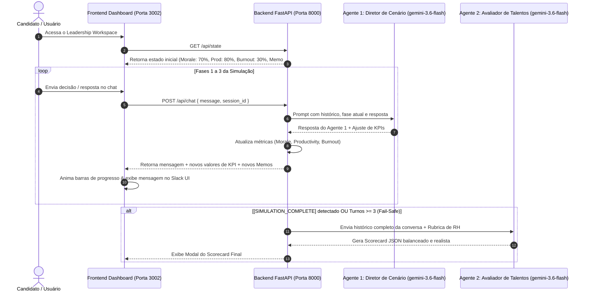

# Guia de Estudos - Módulo 4: Cymbal Leadership Simulator (Simulador Gamificado Multi-Agente)

Este guia documenta a arquitetura, design de interface, lógica de estado, sistema multi-agente e avaliação automatizada do **Cymbal Leadership Simulator** da Cymbal AI.

---

## 📌 Sumário
1. [Visão Geral e Objetivos de Negócio](#1-visão-geral-e-objetivos-de-negócio)
2. [Arquitetura de Alto Nível](#2-arquitetura-de-alto-nível)
3. [O "Leadership Workspace" (Design System e 3 Painéis)](#3-o-leadership-workspace-design-system-e-3-painéis)
4. [Arquitetura Multi-Agente (Agente 1 e Agente 2)](#4-arquitetura-multi-agente-agente-1-e-agente-2)
5. [Gerenciamento de Estado e Lógica de KPIs Dinâmicos](#5-gerenciamento-de-estado-e-lógica-de-kpis-dinâmicos)
6. [Mecanismo de Graduação Fail-Safe](#6-mecanismo-de-graduação-fail-safe)
7. [Endpoints REST e Fluxo de Comunicação](#7-endpoints-rest-e-fluxo-de-comunicação)
8. [Script de Inicialização e Execução Local (`run_local.sh`)](#8-script-de-inicialização-e-execução-local-run_localsh)

---

## 1. Visão Geral e Objetivos de Negócio

O **Cymbal Leadership Simulator** é uma plataforma interativa de triagem e avaliação de liderança para a Cymbal AI. Em vez de testes tradicionais de código ou perguntas teóricas de múltipla escolha, os candidatos a cargos de gestão e liderança são submetidos a uma simulação em tempo real sobre dinâmicas de equipe, resolução de conflitos e decisões sob pressão.

### Competências Avaliadas:
1. **Empatia & Escuta Ativa** (*Empathy & Active Listening*)
2. **Tomada de Decisão Estratégica** (*Strategic Decision-Making*)
3. **Clarity & Accountability** (*Clareza e Responsabilização*)

---

## 2. Arquitetura de Alto Nível

A aplicação é dividida em uma estrutura descentralizada composta por Backend FastAPI, Frontend com estética corporativa em cristal de vidro (glassmorphism) e orquestração de 2 agentes baseados no **Gemini 3.6 Flash**.



---

## 3. O "Leadership Workspace" (Design System e 3 Painéis)

A interface do usuário é dividida em três painéis principais integrados:

### 1. Painel de Métricas de Saúde da Equipe (Leadership KPIs)
- **😊 Team Morale**: Inicia em **70%** (Cor: Verde Esmeralda `#10B981`)
- **📈 Productivity**: Inicia em **80%** (Cor: Azul Céu `#3B82F6`)
- **🔥 Burnout Risk**: Inicia em **30%** (Cor: Vermelho Âmbar `#EF4444`)
- **Comportamento**: As barras de progresso animam com transições suaves via CSS (`transition: width 0.6s`) e indicam tendências dinâmicas (`+10% ↑`, `-5% ↓`, `--`).

### 2. Painel de Inbox & Memos de Crise
Exibe documentos contextuais e relatórios de emergência desbloqueados a cada fase:
- **Fase 1 Memo**: *ESCALATION: Dev Team Alpha Dispute* (impasse técnico e recusa de revisão de código entre o Arquiteto Líder Dev A e o Engenheiro Senior Dev B).
- **Fase 2 Memo**: *TIMELINE ALERT: Q3 Launch Deadline Risk* (alerta de atraso de 40 horas a 3 dias do lançamento oficial).
- **Fase 3 Memo**: *PERFORMANCE NOTE: Jordan M.* (contexto sobre funcionário de alto desempenho com queda de produtividade e faltas em standups).

### 3. Hub de Comunicação (Interface Chat Slack-Style)
- Interface de chat no canal `#team-crisis-room` interagindo com o **Agente 1** (Sam, HR Advisor).
- Possui indicador visual de digitação (*typing indicator*), suporte a marcadores em negrito e botões com sugestões rápidas de ações recomendadas por fase.

---

## 4. Arquitetura Multi-Agente (Agente 1 e Agente 2)

O sistema utiliza dois agentes distintos para separar a condução da experiência conversacional da avaliação objetiva de RH.

### Agente 1: Diretor de Cenários & Coach de RH
- **Modelo**: `gemini-3.6-flash`
- **Função**: Conduz o candidato sequencialmente por 3 fases críticas:
  1. **Fase 1 (The Dispute)**: Conflito interpessoal e arquitetural entre Dev A e Dev B.
  2. **Fase 2 (The Crunch Time Dilemma)**: Escolha entre exigir hora extra no fim de semana (aumenta produtividade, mas eleva burnout e reduz moral) ou negociar adiamento de prazo (preserva moral e burnout, mas reduz produtividade).
  3. **Fase 3 (The Feedback Session)**: Condução de feedback construtivo para Jordan M.
- **Gatilho de Finalização**: Ao receber a resposta da Fase 3, o Agente 1 adiciona a tag `[SIMULATION_COMPLETE]` ao final de sua resposta.

### Agente 2: Avaliador de Talentos (Talent Evaluator)
- **Modelo**: `gemini-3.6-flash`
- **Função**: Processa o transcript completo da conversa e avalia o desempenho contra a rubrica de RH.
- **Diretriz de Rigor**: A avaliação deve ser **realista, objetiva e sem elogios inflacionados**. As pontuações refletem o equilíbrio real das decisões do candidato.
- **Esquema de Saída JSON**:
```json
{
  "overall_rating": "Strong Leader | Developing | Needs Support",
  "score_breakdown": {
    "empathy_and_listening": 85,
    "strategic_decision_making": 72,
    "clarity_and_accountability": 78
  },
  "strengths": [
    "Demonstrou escuta ativa e empatia na mediação do conflito da equipe."
  ],
  "areas_for_growth": [
    "Poderia definir metas e prazos mais claros durante o alinhamento de feedback."
  ],
  "summary_verdict": "O candidato apresentou perfil de liderança em desenvolvimento, com boa base empática..."
}
```

---

## 5. Gerenciamento de Estado e Lógica de KPIs Dinâmicos

O estado da sessão é mantido em memória no backend FastAPI e modelado via Pydantic:

```python
class SimulationStateModel(BaseModel):
    session_id: str
    current_phase: int = 1
    morale: int = 70
    productivity: int = 80
    burnout_risk: int = 30
    turn_count: int = 0
    transcript: List[Dict[str, str]] = []
    is_completed: bool = False
    memos: List[MemoItem] = []
    evaluation: Optional[EvaluationResult] = None
```

### Regras de Ajuste de Métricas por Escolha:
- **Abordagem Empática / Colaborativa**: Morale (+10%), Burnout (-5%), Productivity (-5%).
- **Abordagem de Alta Pressão / Autoritária**: Morale (-15%), Burnout (+15%), Productivity (+10%).
- **Abordagem de Compromisso Equilibrado**: Morale (+5%), Burnout (-5%), Productivity (+5%).

---

## 6. Mecanismo de Graduação Fail-Safe

Para garantir que a simulação sempre encerre de forma graciosa e entregue o scorecard final ao candidato — mesmo que o modelo omita a string `[SIMULATION_COMPLETE]` — o backend possui uma regra de graduação automática:

> **Regra Fail-Safe**: Se o contador de turnos (`turn_count`) atingir 3 respostas do candidato, o sistema força a transição de estado para `is_completed = True` e invoca automaticamente o **Agente 2** para gerar a avaliação final.

---

## 7. Endpoints REST e Fluxo de Comunicação

O backend FastAPI expõe os seguintes endpoints REST com suporte a CORS para a origem `http://localhost:3002`:

| Método | Endpoint | Descrição |
| :--- | :--- | :--- |
| `GET` | `/api/health` | Verifica a saúde do serviço backend. |
| `GET` | `/api/state` | Retorna o estado atual da simulação (fase, métricas, histórico e memos). |
| `POST` | `/api/chat` | Envia a resposta do candidato, executa o Agente 1, atualiza KPIs e aciona o Agente 2 se concluído. |
| `POST` | `/api/evaluate` | Aciona manualmente a avaliação do Agente 2 sobre o histórico atual. |
| `POST` | `/api/reset` | Reinicia a simulação para o estado inicial da Fase 1. |

---

## 8. Script de Inicialização e Execução Local (`run_local.sh`)

O arquivo `run_local.sh` gerencia a execução simultânea dos serviços do backend e do frontend:

```bash
#!/usr/bin/env bash
set -e

# Executa o Backend FastAPI na porta 8000
python3 -m uvicorn main:app --app-dir ./backend --host 0.0.0.0 --port 8000 &
BACKEND_PID=$!

# Executa o Servidor Estático Frontend na porta 3002
python3 ./frontend/server.py &
FRONTEND_PID=$!

wait $BACKEND_PID $FRONTEND_PID
```

### URLs de Acesso Local:
- **Frontend Dashboard**: `http://localhost:3002`
- **Backend API**: `http://localhost:8000`
