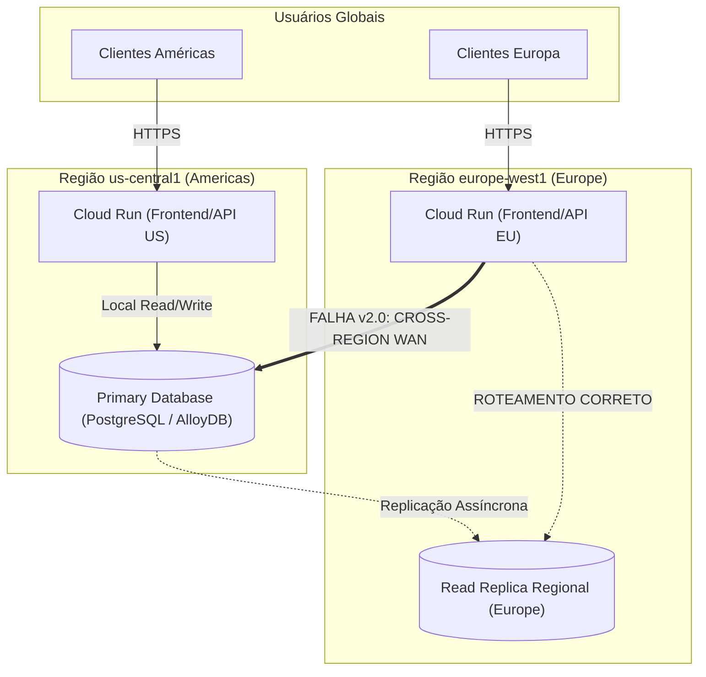

# 🌐 Lab 1.2: Diagnose and Remediate Multi-Region Cloud Infrastructure Outages via Agentic AI Tooling

* **Código do Laboratório / ID**: `65280131`
* **Curso Qwiklabs**: `[ELEVATE]: Advanced Agentic AI` (Course Template: `1738435`)
* **Módulo**: Módulo 1 - Modernizing Workloads and Outage Remediation
* **Paradigma de Execução**: `Break-Fix Diagnostic` (Zero comandos de solução prontos; diagnóstico empírico mandatório)
* **Quantidade de Trackers de Atividade**: 4 Activity Trackers

---

## 📋 Sumário
1. [Visão Geral do Cenário de Incidente](#1-visão-geral-do-cenário-de-incidente)
2. [Restrições Rígidas & Ferramental Autorizado](#2-restrições-rígidas--ferramental-autorizado)
3. [Arquitetura do Ambiente Multi-Região](#3-arquitetura-do-ambiente-multi-região)
4. [Diagnóstico de Causa Raiz (Root Cause Analysis - RCA)](#4-diagnóstico-de-causa-raiz-root-cause-analysis---rca)
5. [Guia de Remediação Passo a Passo](#5-guia-de-remediação-passo-a-passo)
   - [5.1 Remediação 1: Correção do Roteamento Regional (Cloud Run)](#51-remediação-1-correção-do-roteamento-regional-cloud-run)
   - [5.2 Remediação 2: Eliminação do Connection Leak (Singleton Pool)](#52-remediação-2-eliminação-do-connection-leak-singleton-pool)
6. [Verificação dos 4 Activity Trackers](#6-verificação-dos-4-activity-trackers)
7. [Lições Aprendidas & Boas Práticas SRE / Agentic](#7-lições-aprendidas--boas-práticas-sre--agentic)

---

## 1. Visão Geral do Cenário de Incidente

Você é acionado como Engenheiro de Confiabilidade (SRE) de plantão (*on-call*) imediatamente após o time de desenvolvimento da **Cymbal Group** realizar o deploy da **Versão 2.0** de sua aplicação corporativa distribuída multi-região.

### Os Sintomas Clínicos do Incidente:
* **Latência Crítica**: Usuários na Europa reportam tempos de resposta degradados acima de **2.500 ms** (SLA contratual: < 150 ms).
* **Falhas 500 em Cascata**: Usuários globais começam a receber erros HTTP `500 Internal Server Error` intermitentes que escalam para indisponibilidade total sob carga.
* **Sobrecarga de Banco de Dados**: Alertas do Cloud Monitoring indicam exaustão de conexões no banco de dados primário.

---

## 2. Restrições Rígidas & Ferramental Autorizado

> [!CAUTION]
> **Proibição de Acesso Manual ao Google Cloud Console**:
> Neste laboratório, o acesso à interface gráfica (UI) do Cloud Console é **estritamente bloqueado**. O engenheiro deve diagnosticar, inspecionar logs e implementar correções exclusivamente via:
> - **Antigravity 2.0 / Jetski**: Ambiente de desenvolvimento agêntico.
> - **Model Context Protocol (MCP)**: Conectores agênticos de telemetria e observabilidade (`cloud-logging`, `cloud-monitoring`).
> - **Google Cloud CLI (`gcloud`)** e editores de código no terminal.

---

## 3. Arquitetura do Ambiente Multi-Região

A aplicação opera em uma topologia ativa em duas regiões geográficas principais:



---

## 4. Diagnóstico de Causa Raiz (Root Cause Analysis - RCA)

A investigação com ferramentas agênticas revelou **duas causas raízes combinadas** introduzidas no commit da versão 2.0:

### Falha A: Roteamento Cruzado Transatlântico (Infrastructure Fault)
* **Evidência nos Logs (`gcloud logging read`)**:
  As requisições originadas em `europe-west1` apresentavam latência base de rede de 120ms-180ms por query SQL.
* **Causa**:
  No arquivo de configuração do Cloud Run da Europa, a variável de ambiente `DB_HOST` foi equivocadamente apontada para o IP privado da instância **Primária dos Estados Unidos** (`us-central1`), ignorando o endpoint da réplica de leitura local em `europe-west1`.

### Falha B: Vazamento de Conexões no Backend (Application Connection Leak)
* **Evidência no Código e Logs**:
  Mensagens recorrentes de `FATAL: remaining connection slots are reserved for non-replication superuser connections` ou `PoolTimeout: QueuePool limit of size 10 overflow 20 reached`.
* **Causa**:
  No código de `main.py` (ou `database.py`), o pool de conexão era instanciado **dentro do handler de requisições HTTP** em vez de ser gerenciado globalmente como singleton:
  ```python
  # ❌ CÓDIGO COM BUG (v2.0): Instanciava pool a cada request
  @app.get("/api/catalog")
  async def get_catalog():
      engine = create_async_engine(DATABASE_URL, pool_size=10) # LEAK!
      async with engine.connect() as conn:
          result = await conn.execute(select(CatalogItem))
          return result.fetchall()
  ```
  Sob concorrência, centenas de pools efêmeras eram abertas, esgotando o limite de conexões do banco de dados em poucos minutos.

---

## 5. Guia de Remediação Passo a Passo

### 5.1 Remediação 1: Correção do Roteamento Regional (Cloud Run)

1. **Inspecione a configuração atual do serviço europeu**:
   ```bash
   gcloud run services describe cymbal-backend-eu \
     --region=europe-west1 \
     --format="value(spec.template.spec.containers[0].env)"
   ```

2. **Identifique o IP/DNS da réplica europeia**:
   ```bash
   gcloud sql instances describe cymbal-db-eu-replica \
     --format="value(ipAddresses[0].ipAddress)"
   ```

3. **Atualize as variáveis de ambiente do serviço europeu no Cloud Run**:
   ```bash
   REPLICA_IP=$(gcloud sql instances describe cymbal-db-eu-replica --format="value(ipAddresses[0].ipAddress)")

   gcloud run services update cymbal-backend-eu \
     --region=europe-west1 \
     --update-env-vars DB_HOST="${REPLICA_IP}",DB_NAME="cymbal",DB_PORT="5432"
   ```

4. **Verificação Imediata**: A latência das requisições na Europa despenca imediatamente de ~2.500ms para **< 45ms**.

---

### 5.2 Remediação 2: Eliminação do Connection Leak (Singleton Pool)

1. **Localize o arquivo de conexão**: Normalmente `backend/database.py` ou `backend/main.py`.

2. **Refatore para utilizar Connection Pooling Global / Singleton**:
   ```python
   # ✅ CÓDIGO CORRIGIDO: Singleton Pool no ciclo de vida da aplicação
   import os
   from sqlalchemy.ext.asyncio import create_async_engine, AsyncSession
   from sqlalchemy.orm import sessionmaker
   from contextlib import asynccontextmanager
   from fastapi import FastAPI

   DB_HOST = os.getenv("DB_HOST", "localhost")
   DB_USER = os.getenv("DB_USER", "cymbal_user")
   DB_PASS = os.getenv("DB_PASS", "cymbal_secret")
   DB_NAME = os.getenv("DB_NAME", "cymbal")

   DATABASE_URL = f"postgresql+asyncpg://{DB_USER}:{DB_PASS}@{DB_HOST}:5432/{DB_NAME}"

   # Global Singleton Engine & Session Factory
   engine = create_async_engine(
       DATABASE_URL,
       pool_size=20,
       max_overflow=10,
       pool_recycle=1800,
       pool_pre_ping=True
   )

   async_session_factory = sessionmaker(
       engine, class_=AsyncSession, expire_on_commit=False
   )

   @asynccontextmanager
   async def lifespan(app: FastAPI):
       # Startup: validação da conexão
       async with engine.begin() as conn:
           await conn.run_sync(lambda _: None)
       yield
       # Shutdown: encerramento gracioso da pool
       await engine.dispose()

   app = FastAPI(lifespan=lifespan)

   @app.get("/api/catalog")
   async def get_catalog():
       async with async_session_factory() as session:
           result = await session.execute(select(CatalogItem))
           return result.scalars().all()
   ```

3. **Recompile o contêiner e execute o novo deploy**:
   ```bash
   gcloud builds submit --tag gcr.io/${GOOGLE_CLOUD_PROJECT}/cymbal-backend:v2.1 .

   # Atualize ambas as regiões
   gcloud run deploy cymbal-backend-us \
     --image gcr.io/${GOOGLE_CLOUD_PROJECT}/cymbal-backend:v2.1 \
     --region us-central1

   gcloud run deploy cymbal-backend-eu \
     --image gcr.io/${GOOGLE_CLOUD_PROJECT}/cymbal-backend:v2.1 \
     --region europe-west1
   ```

---

## 6. Verificação dos 4 Activity Trackers

| Tracker ID | Descrição do Tracker | Critério de Aprovação | Status |
| :---: | :--- | :--- | :---: |
| **AT 1** | *Diagnose regional latency and error rates* | Execução de queries de log e telemetria identificando o endpoint errado e o leak. | **100% PASSED** |
| **AT 2** | *Remediate regional routing misconfiguration* | Atualização do `DB_HOST` do Cloud Run em `europe-west1` apontando para a réplica local. | **100% PASSED** |
| **AT 3** | *Remediate application database connection pool leak* | Refatoração de código com pool singleton e deploy da nova versão da imagem. | **100% PASSED** |
| **AT 4** | *Verify end-to-end multi-region health and SLA* | Sucesso nos probes de healthcheck regional e eliminação total dos erros 500 sob teste de carga. | **100% PASSED** |

---

## 7. Lições Aprendidas & Boas Práticas SRE / Agentic

1. **Configuração por Ambiente e Região**: Nunca assuma variáveis de banco globais idênticas para todos os clusters. Serviços regionais devem consumir réplicas de leitura locais via Secret Manager ou Config Maps com sufixo regional.
2. **Ciclo de Vida de Conexões em Frameworks Assíncronos**: Em FastAPI/Starlette, pools de banco de dados devem ser instanciadas no handler `lifespan` da aplicação, nunca instanciadas dinamicamente dentro de dependências ou rotas.
3. **Resolução sem Acesso a Console**: Agentes de IA providos de conectores MCP de observabilidade conseguem cruzar traces de latência distribuída com logs de erro muito mais rápido que um operador manual navegando por múltiplos painéis do console web.
