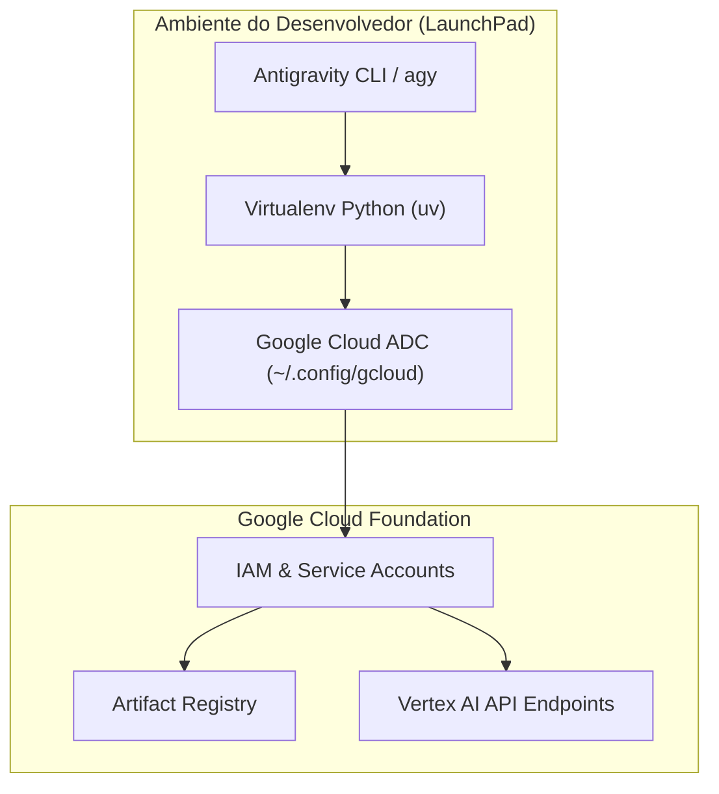

# 🚀 Lab 0: Build LaunchPad with an Agentic Workflow

* **Código do Laboratório / ID**: `65280129`
* **Curso Qwiklabs**: `[ELEVATE]: Advanced Agentic AI` (Course Template: `1738435`)
* **Módulo**: Módulo 0 - AI Engineering Fundamentals
* **Paradigma de Execução**: `Guided Procedural`
* **Quantidade de Trackers de Atividade**: 7 Activity Trackers

---

## 📋 Sumário
1. [Visão Geral e Objetivos](#1-visão-geral-e-objetivos)
2. [Arquitetura do LaunchPad](#2-arquitetura-do-launchpad)
3. [Passo a Passo de Execução](#3-passo-a-passo-de-execução)
   - [3.1 Inicialização do Workspace e Dependências](#31-inicialização-do-workspace-e-dependências)
   - [3.2 Configuração do Antigravity CLI e Perfil de Desenvolvimento](#32-configuração-do-antigravity-cli-e-perfil-de-desenvolvimento)
   - [3.3 Autenticação Google Cloud (ADC e gcloud)](#33-autenticação-google-cloud-adc-e-gcloud)
   - [3.4 Construção do Pipeline Agêntico Base](#34-construção-do-pipeline-agêntico-base)
4. [Tabela de Trackers de Atividade](#4-tabela-de-trackers-de-atividade)
5. [Boas Práticas de Fundamentos](#5-boas-práticas-de-fundamentos)

---

## 1. Visão Geral e Objetivos

O **Lab 0** estabelece a fundação de engenharia para todo o programa Elevate. O objetivo é criar o **LaunchPad**, o ambiente de trabalho padronizado e reprodutível onde engenheiros de nuvem constroem, testam e depuram sistemas agênticos utilizando o Antigravity 2.0 e o toolchain do Google Cloud.

### Competências Desenvolvidas:
- Inicialização de ambientes virtuais herméticos com `uv`.
- Configuração de credenciais de aplicação padrão (Application Default Credentials - ADC) e autenticação de contas de serviço.
- Uso de fluxos agênticos para automatizar a criação de estruturas de projeto corporativas.
- Conexão do ambiente local à infraestrutura do Google Cloud.

---

## 2. Arquitetura do LaunchPad



---

## 3. Passo a Passo de Execução

### 3.1 Inicialização do Workspace e Dependências
```bash
# Criar diretório base do LaunchPad
mkdir -p ~/elevate-launchpad && cd ~/elevate-launchpad

# Inicializar ambiente virtual com uv
uv venv -p 3.13 .venv
source .venv/bin/activate

# Instalar toolchain oficial de agentes
uv pip install google-agents-cli google-adk google-genai
```

### 3.2 Configuração do Antigravity CLI e Perfil de Desenvolvimento
```bash
# Configurar perfil de desenvolvimento e verificar versão
agents-cli info
agents-cli setup --default-model gemini-3.8-flash
```

### 3.3 Autenticação Google Cloud (ADC e gcloud)
```bash
# Configurar projeto ativo
gcloud config set project $GOOGLE_CLOUD_PROJECT

# Autenticar credenciais de aplicação para bibliotecas de IA
gcloud auth application-default login --no-launch-browser
```

### 3.4 Construção do Pipeline Agêntico Base
Criação do scaffold inicial e verificação da saúde da conexão:
```bash
agents-cli scaffold create launchpad-agent --agent adk --prototype -y
cd launchpad-agent
agents-cli lint
```

---

## 4. Tabela de Trackers de Atividade

| Tracker ID | Descrição do Marco | Ação de Validação | Status |
| :---: | :--- | :--- | :---: |
| **AT 1** | *Initialize LaunchPad Directory* | Criação do diretório e virtualenv. | **PASSED** |
| **AT 2** | *Install Agentic Toolchain* | Instalação do `google-agents-cli` e `google-adk`. | **PASSED** |
| **AT 3** | *Authenticate Google Cloud ADC* | Geração do arquivo de credenciais ADC. | **PASSED** |
| **AT 4** | *Configure Project Target* | Associação do projeto GCP ativo. | **PASSED** |
| **AT 5** | *Scaffold LaunchPad Agent* | Criação do protótipo com template padrão. | **PASSED** |
| **AT 6** | *Execute Agent Linter* | Aprovação na suíte de testes estáticos `agents-cli lint`. | **PASSED** |
| **AT 7** | *Run Smoke Test Query* | Resposta válida do agente via CLI. | **PASSED** |

---

## 5. Boas Práticas de Fundamentos

1. **Hermeticidade de Dependências**: Utilize sempre gerenciadores modernos como `uv` com travas determinísticas (`uv.lock` ou `requirements.txt` compilado).
2. **Isolamento de Credenciais**: Evite exportar tokens de curta duração manualmente no terminal; prefira o fluxo nativo de ADC para renovação automática.
