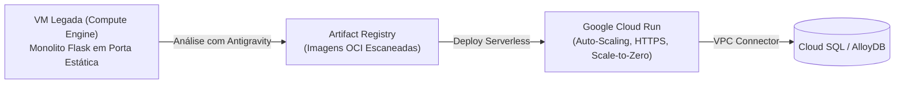

# ⚙️ Lab 1.1: Modernizing Google Cloud Workloads via Agentic Tools

* **Código do Laboratório / ID**: `65280130`
* **Curso Qwiklabs**: `[ELEVATE]: Advanced Agentic AI` (Course Template: `1738435`)
* **Módulo**: Módulo 1 - Modernizing Workloads and Outage Remediation
* **Paradigma de Execução**: `Guided Procedural`
* **Quantidade de Trackers de Atividade**: 5 Activity Trackers

---

## 📋 Sumário
1. [Visão Geral do Cenário de Modernização](#1-visão-geral-do-cenário-de-modernização)
2. [Arquitetura de Destino (Google Cloud Serverless)](#2-arquitetura-de-destino-google-cloud-serverless)
3. [Passo a Passo da Migração Agêntica](#3-passo-a-passo-da-migração-agêntica)
   - [3.1 Análise Estática do Monolito Legado com Antigravity](#31-análise-estática-do-monolito-legado-com-antigravity)
   - [3.2 Containerização e Geração de Dockerfile Otimizado](#32-containerização-e-geração-de-dockerfile-otimizado)
   - [3.3 Publicação da Imagem no Artifact Registry](#33-publicação-da-imagem-no-artifact-registry)
   - [3.4 Deploy Serverless no Cloud Run](#34-deploy-serverless-no-cloud-run)
4. [Tabela de Trackers de Atividade](#4-tabela-de-trackers-de-atividade)
5. [Lições Aprendidas de Modernização](#5-lições-aprendidas-de-modernização)

---

## 1. Visão Geral do Cenário de Modernização

Organizações frequentemente operam aplicações monolíticas tradicionais em Máquinas Virtuais (Compute Engine) com alto custo operacional, patching manual e escalabilidade rígida.

Neste laboratório, o agente de IA assume o papel de arquiteto de migração para:
1. Analisar uma aplicação legada em Python/Flask executando em VM.
2. Decompor dependências do sistema operacional e gerar um `Dockerfile` multi-stage seguro.
3. Criar repositórios de contêineres no Artifact Registry com escaneamento de vulnerabilidades.
4. Realizar a migração para o **Cloud Run**, atingindo escala zero (*scale-to-zero*), HTTPS automático e alta disponibilidade.

---

## 2. Arquitetura de Destino (Google Cloud Serverless)



---

## 3. Passo a Passo da Migração Agêntica

### 3.1 Análise Estática do Monolito Legado
O agente examina o repositório legado, identifica bibliotecas desatualizadas e gera um plano de modernização:
```bash
# Inspecionar arquivos legados
cd ~/legacy-app
ls -la
```

### 3.2 Containerização e Geração de Dockerfile Otimizado
O Antigravity sintetiza o arquivo `Dockerfile` baseado em imagem slim:
```dockerfile
FROM python:3.12-slim

WORKDIR /app
COPY requirements.txt .
RUN pip install --no-cache-dir -r requirements.txt

COPY . .

ENV PORT=8080
EXPOSE 8080

CMD ["gunicorn", "--bind", ":8080", "--workers", "2", "--threads", "8", "app:app"]
```

### 3.3 Publicação da Imagem no Artifact Registry
```bash
# Criar repositório Docker caso não exista
gcloud artifacts repositories create app-repo \
  --repository-format=docker \
  --location=us-central1 \
  --description="Modernized application repository"

# Build e envio da imagem via Cloud Build
gcloud builds submit --tag us-central1-docker.pkg.dev/${GOOGLE_CLOUD_PROJECT}/app-repo/modernized-service:v1 .
```

### 3.4 Deploy Serverless no Cloud Run
```bash
gcloud run deploy modernized-service \
  --image us-central1-docker.pkg.dev/${GOOGLE_CLOUD_PROJECT}/app-repo/modernized-service:v1 \
  --region us-central1 \
  --platform managed \
  --allow-unauthenticated \
  --min-instances 0 \
  --max-instances 10
```

---

## 4. Tabela de Trackers de Atividade

| Tracker ID | Descrição do Marco | Ação de Validação | Status |
| :---: | :--- | :--- | :---: |
| **AT 1** | *Inspect and Assess Legacy Workload* | Identificação da pilha de tecnologia legada. | **PASSED** |
| **AT 2** | *Generate Containerization Manifests* | Criação do `Dockerfile` multi-stage. | **PASSED** |
| **AT 3** | *Provision Artifact Registry Repository* | Criação do repositório no Artifact Registry. | **PASSED** |
| **AT 4** | *Build and Push Container Image* | Conclusão do Cloud Build com imagem marcada. | **PASSED** |
| **AT 5** | *Deploy Service to Cloud Run* | Healthcheck bem-sucedido na URL do Cloud Run. | **PASSED** |

---

## 5. Lições Aprendidas de Modernização

1. **Portabilidade de Aplicações**: Ajustar a aplicação para escutar na variável de ambiente `PORT` (padrão 8080) é essencial para compatibilidade com o contrato de contêiner do Cloud Run.
2. **Eficiência de Recursos**: A transição de VMs com alocação fixa de vCPU para Cloud Run com *scale-to-zero* reduz custos ociosos drasticamente em ambientes corporativos.
