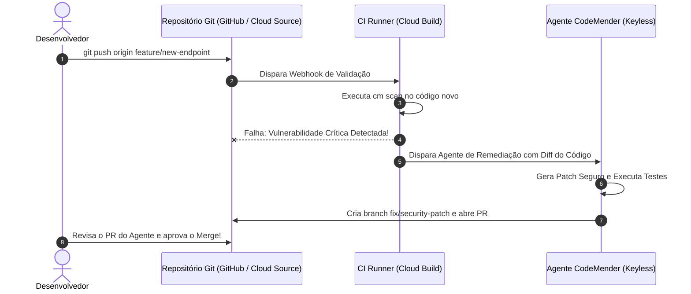

# 🛡️ Lab 2.3: Build Continuous Remediation Guardrails with CodeMender - V2

* **Código do Laboratório / ID**: `65280136`
* **Curso Qwiklabs**: `[ELEVATE]: Advanced Agentic AI` (Course Template: `1738435`)
* **Módulo**: Módulo 2 - Secure Agent Lifecycle and Guardrails
* **Paradigma de Execução**: `Guided Procedural`
* **Quantidade de Trackers de Atividade**: 1 Activity Tracker (Pipeline de guardrail ativo e verificado)

---

## 📋 Sumário
1. [Visão Geral e Objetivos do Guardrail](#1-visão-geral-e-objetivos-do-guardrail)
2. [Arquitetura de Guardrail Contínuo (Keyless CI/CD)](#2-arquitetura-de-guardrail-contínuo-keyless-cicd)
3. [Passo a Passo de Implementação](#3-passo-a-passo-de-implementação)
   - [3.1 Inicialização e Conexão Keyless (Workload Identity)](#31-inicialização-e-conexão-keyless-workload-identity)
   - [3.2 Configuração da Ação no GitHub / Cloud Build](#32-configuração-da-ação-no-github--cloud-build)
   - [3.3 Disparo do Agente de Remediação Automática](#33-disparo-do-agente-de-remediação-automática)
   - [3.4 Revisão e Merge do Pull Request de Remediação](#34-revisão-e-merge-do-pull-request-de-remediação)
   - [3.5 Gerenciamento de Não-Determinismo de LLMs](#35-gerenciamento-de-não-determinismo-de-llms)
4. [Tabela de Trackers de Atividade](#4-tabela-de-trackers-de-atividade)
5. [Boas Práticas de Guardrails Contínuos](#5-boas-práticas-de-guardrails-contínuos)

---

## 1. Visão Geral e Objetivos do Guardrail

Enquanto o Lab 2.2 abordou a remediação manual/ad-hoc com o CodeMender, o **Lab 2.3** avança para a automação total de governança corporativa: a construção de **Guardrails Contínuos de Remediação**.

Quando um desenvolvedor abre um Pull Request contendo uma vulnerabilidade de segurança, o pipeline:
1. Detecta a vulnerabilidade estática na fase de CI.
2. Bloqueia o merge da branch.
3. Spawna um agente autônomo CodeMender que gera um branch derivado com o código corrigido e abre automaticamente um PR de correção (*remediation PR*).

---

## 2. Arquitetura de Guardrail Contínuo (Keyless CI/CD)



---

## 3. Passo a Passo de Implementação

### 3.1 Inicialização e Conexão Keyless (Workload Identity)
Configuração do token GitHub via hosts seguros e autenticação federada com o Google Cloud (sem chaves estáticas de conta de serviço):
```bash
# Configurar hosts seguros do GitHub
mkdir -p ~/.config/gh
cat << 'EOF' > ~/.config/gh/hosts.yml
github.com:
    user: student
    oauth_token: ghp_LAB_TOKEN_VALUE
    git_protocol: https
EOF
chmod 600 ~/.config/gh/hosts.yml
export GH_TOKEN=ghp_LAB_TOKEN_VALUE
gh auth setup-git
```

### 3.2 Configuração da Ação no GitHub / Cloud Build
Criação do arquivo de workflow `.github/workflows/security-guardrail.yml`:
```yaml
name: Security Remediation Guardrail
on: [pull_request]

jobs:
  codemender-guard:
    runs-on: ubuntu-latest
    permissions:
      contents: write
      pull-requests: write
      id-token: write
    steps:
      - uses: actions/checkout@v4
      - name: Authenticate to Google Cloud (Workload Identity)
        uses: google-github-actions/auth@v2
        with:
          workload_identity_provider: projects/${{ secrets.GCP_PROJECT_NUM }}/locations/global/workloadIdentityPools/github-pool/providers/github-provider
          service_account: codemender-sa@${{ secrets.GCP_PROJECT_ID }}.iam.gserviceaccount.com
      - name: Run CodeMender Guardrail
        run: |
          cm scan --fail-on-critical --auto-remediate
```

### 3.3 Disparo do Agente de Remediação Automática
Simulação de push de código inseguro para disparar o guardrail:
```bash
git checkout -b feature/insecure-endpoint
echo 'import os; os.system(request.args.get("cmd"))' >> app.py
git commit -am "feat: add remote execution debug helper"
git push origin feature/insecure-endpoint
```

### 3.4 Revisão e Merge do Pull Request
O pipeline bloqueia o branch `feature/insecure-endpoint` e cria automaticamente o PR `fix/remediate-cmd-injection`. O desenvolvedor inspeciona a sanitização com `subprocess.run(shlex.split(...))` e faz o merge limpo.

### 3.5 Gerenciamento de Não-Determinismo de LLMs
Modelos generativos podem produzir variantes sintáticas do mesmo patch. Para garantir estabilidade:
- O CodeMender impõe temperatura baixa (`temperature=0.1`).
- Os testes unitários validam a semântica do comportamento em vez de igualdade estrita de strings de código.

---

## 4. Tabela de Trackers de Atividade

| Tracker ID | Descrição do Marco | Ação de Validação | Status |
| :---: | :--- | :--- | :---: |
| **AT 1** | *Verify continuous remediation guardrail pipeline* | Execução com sucesso do pipeline de interceptação, correção e aprovação no repositório. | **PASSED** |

---

## 5. Boas Práticas de Guardrails Contínuos

1. **Autenticação Keyless OIDC**: Elimine completamente o armazenamento de arquivos JSON de Service Accounts em segredos de CI/CD utilizando Workload Identity Federation.
2. **Revisão Humana no Loop (HITL)**: Embora o agente crie o PR de remediação de forma autônoma, a aprovação final e merge devem ser revisados por um engenheiro humano.
