# 🔍 Lab 2.2: Vulnerability Scanning and Remediation with VulnHawk CodeMender

* **Código do Laboratório / ID**: `65280135`
* **Curso Qwiklabs**: `[ELEVATE]: Advanced Agentic AI` (Course Template: `1738435`)
* **Módulo**: Módulo 2 - Secure Agent Lifecycle and Guardrails
* **Paradigma de Execução**: `Guided Procedural`
* **Quantidade de Trackers de Atividade**: 1 Activity Tracker (Auditoria e remediação verificada)

---

## 📋 Sumário
1. [Visão Geral do CodeMender / VulnHawk](#1-visão-geral-do-codemender--vulnhawk)
2. [Arquitetura de Escaneamento e Remediação](#2-arquitetura-de-escaneamento-e-remediação)
3. [Passo a Passo de Execução](#3-passo-a-passo-de-execução)
   - [3.1 Inicialização e Descoberta de Vulnerabilidades (`cm find`)](#31-inicialização-e-descoberta-de-vulnerabilidades-cm-find)
   - [3.2 Análise Estática de CWEs (SSRF, Injeção SQL, Path Traversal)](#32-análise-estática-de-cwes-ssrf-injeção-sql-path-traversal)
   - [3.3 Correção Automatizada de Código (`cm fix`)](#33-correção-automatizada-de-código-cm-fix)
   - [3.4 Auditoria Completa e Exportação de Relatório de Segurança para GCS](#34-auditoria-completa-e-exportação-de-relatório-de-segurança-para-gcs)
4. [Tabela de Trackers de Atividade](#4-tabela-de-trackers-de-atividade)
5. [Boas Práticas de DevSecOps Agêntico](#5-boas-práticas-de-devsecops-agêntico)

---

## 1. Visão Geral do CodeMender / VulnHawk

O **VulnHawk CodeMender** (`cm`) é a ferramenta agêntica interna do Google Cloud especializada em análise estática avançada de código-fonte (SAST) e remediação assistida por IA.

Diferente de scanners convencionais que apenas emitem alertas e pontuações de CVSS, o CodeMender:
1. Compreende a Abstract Syntax Tree (AST) do projeto.
2. Identifica padrões de vulnerabilidade conhecidos (CWEs e OWASP Top 10).
3. Gera patches cirúrgicos com testes unitários automáticos para comprovar que a vulnerabilidade foi eliminada sem quebrar a regra de negócio.

---

## 2. Arquitetura de Escaneamento e Remediação

```mermaid
flowchart LR
    Source["Repositório de Código-Fonte"] -->|cm find| AST["Motor de Análise AST & Semântica"]
    AST -->|Findings com IDs únicos| Scanner["Lista de Vulnerabilidades (ex: CWE-89, CWE-918)"]
    Scanner -->|cm fix finding_id| Agent["Agente LLM CodeMender"]
    Agent -->|Diff / Patch Cirúrgico| Patch["Código Refatorado & Sanitizado"]
    Patch -->|Verificação de Testes| Pass["100% Security Pass & Audit Log"]
```



---

## 3. Passo a Passo de Execução

### 3.1 Inicialização e Descoberta de Vulnerabilidades (`cm find`)
No terminal da máquina de laboratório:
```bash
cd ~/vulnerable-microservice

# Inicializar scanner e listar vulnerabilidades detectadas
cm find --path .
```
O CodeMender atribui um ID único de 8 caracteres hexadecimais para cada ocorrência detectada (ex: `finding_id: 262f09ee`).

### 3.2 Análise Estática de CWEs
Exemplos comuns identificados no microserviço:
- **CWE-89**: Injeção de SQL por interpolação de strings em consultas de banco de dados.
- **CWE-918**: Server-Side Request Forgery (SSRF) em rotas de download de imagens.
- **CWE-22**: Path Traversal na manipulação de uploads de arquivos.

### 3.3 Correção Automatizada de Código (`cm fix`)
Execução da remediação assistida especificando o ID da vulnerabilidade crítica:
```bash
# Aplicar a correção gerada pelo modelo
cm fix 262f09ee --apply

# Executar suíte de testes de regressão
pytest tests/
```

### 3.4 Auditoria Completa e Exportação de Relatório de Segurança para GCS
Após sanar todas as vulnerabilidades pendentes, gera-se o relatório consolidado de conformidade:
```bash
# Gerar auditoria formal
cm audit --output report.json

# Publicar no bucket de auditoria do Google Cloud Storage
gsutil cp report.json gs://${GOOGLE_CLOUD_PROJECT}-security-reports/audit-latest.json
```

---

## 4. Tabela de Trackers de Atividade

| Tracker ID | Descrição do Marco | Ação de Validação | Status |
| :---: | :--- | :--- | :---: |
| **AT 1** | *Verify critical vulnerability is remediated and fixed* | Escaneamento limpo com zero vulnerabilidades críticas remanescentes e relatório no GCS. | **PASSED** |

---

## 5. Boas Práticas de DevSecOps Agêntico

1. **Validação Não-Destrutiva**: Nunca aplique patches de segurança sem validar imediatamente se a funcionalidade original permanece íntegra através de testes unitários.
2. **Identificadores Únicos por Vulnerabilidade**: O uso de hashes/IDs determinísticos para cada achado evita inconsistências em equipes distribuídas e permite rastreabilidade completa em pipelines de CI/CD.
