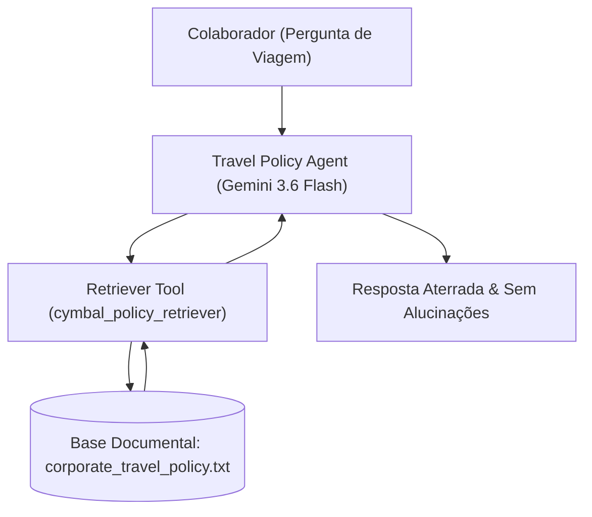

# 🤖 Lab 3.1: Build a Policy Agent with ADK

* **Código do Laboratório / ID**: `65280137`
* **Curso Qwiklabs**: `[ELEVATE]: Advanced Agentic AI` (Course Template: `1738435`)
* **Módulo**: Módulo 3 - Policy Agents, Evaluation, and Challenge Lab
* **Paradigma de Execução**: `Conversational / TDD` (User Manual Mandatory)
* **Quantidade de Trackers de Atividade**: 3 Activity Trackers

---

## 📋 Sumário
1. [Visão Geral do Travel Policy Agent](#1-visão-geral-do-travel-policy-agent)
2. [Arquitetura com Google Agent Development Kit (ADK 2.0)](#2-arquitetura-com-google-agent-development-kit-adk-20)
3. [Passo a Passo de Construção e Aterramento](#3-passo-a-passo-de-construção-e-aterramento)
   - [3.1 Criação do Projeto no Antigravity 2.0](#31-criação-do-projeto-no-antigravity-20)
   - [3.2 Scaffolding e Estrutura de Diretórios](#32-scaffolding-e-estrutura-de-diretórios)
   - [3.3 Implementação do Retriever de Base Documental (`corporate_travel_policy.txt`)](#33-implementação-do-retriever-de-base-documental-corporate_travel_policytxt)
   - [3.4 Validação Local via Antigravity Playground e CLI](#34-validação-local-via-antigravity-playground-e-cli)
4. [Tabela de Trackers de Atividade](#4-tabela-de-trackers-de-atividade)
5. [Boas Práticas de Prompt Engineering & RAG](#5-boas-práticas-de-prompt-engineering--rag)

---

## 1. Visão Geral do Travel Policy Agent

O **Lab 3.1** é o ponto de partida do assistente corporativo **Cymbal Group Travel Policy Concierge**. O agente foi projetado para responder a dúvidas de funcionários sobre despesas corporativas, limites diários de alimentação por país, permissões de classe em voos internacionais e regras de reembolso.

---

## 2. Arquitetura com Google Agent Development Kit (ADK 2.0)



---

## 3. Passo a Passo de Construção e Aterramento

### 3.1 Criação do Projeto no Antigravity 2.0
Inicialização do workspace no Antigravity:
```bash
mkdir -p ~/travel_policy_agent && cd ~/travel_policy_agent
agents-cli scaffold create travel_policy_agent --agent adk --prototype -y
```

### 3.2 Scaffolding e Estrutura de Diretórios
- `main.py`: Ponto de entrada com FastAPI e adaptador A2A.
- `travel_policy_agent/agent.py`: Definição da persona do agente e injeção do modelo `gemini-3.6-flash`.
- `corporate_travel_policy.txt`: Diretrizes corporativas oficiais do Cymbal Group.

### 3.3 Implementação do Retriever de Base Documental
No arquivo `travel_policy_agent/agent.py`, a função de consulta semântica é registrada como ferramenta do agente:
```python
def cymbal_policy_retriever(query: str) -> str:
    """Busca trechos relevantes na política oficial de viagens do Cymbal Group."""
    with open("corporate_travel_policy.txt", "r", encoding="utf-8") as f:
        policy_text = f.read()
    # A biblioteca ADK injeta a política no contexto do modelo
    return policy_text
```

### 3.4 Validação Local via Antigravity Playground e CLI
Testes no terminal para comprovar que o modelo consulta a política antes de responder:
```bash
# Iniciar servidor local
agents-cli playground &

# Executar query direta de validação
agents-cli run "What is the daily meal cap for Switzerland?"
```

---

## 4. Tabela de Trackers de Atividade

| Tracker ID | Descrição do Marco | Ação de Validação | Status |
| :---: | :--- | :--- | :---: |
| **AT 1** | *Create new project in Antigravity 2.0* | Inicialização correta do projeto. | **PASSED** |
| **AT 2** | *Scaffold and build agent application* | Implementação do agente e ferramenta RAG. | **PASSED** |
| **AT 3** | *Test and validate local application* | Resposta correta aterrada no texto da política. | **PASSED** |

---

## 5. Boas Práticas de Prompt Engineering & RAG

1. **System Instructions Restritivas**: Instrua o modelo a nunca extrapolar regras não presentes no documento de política. Para perguntas fora de escopo (como licença parental), deve orientar o contato com o RH.
2. **Citação de Seções Específicas**: Configure a persona para citar o número da seção (ex: "Conforme a Seção 2.1..."), aumentando a auditabilidade corporativa.
