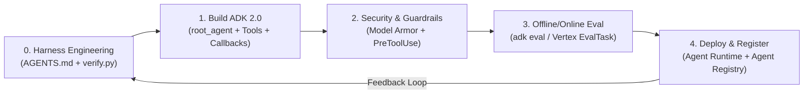

# 🏆 Lab 3.7: Building and Deploying Agentic Systems - Challenge Lab

* **Código do Laboratório / ID**: `65280143`
* **Curso Qwiklabs**: `[ELEVATE]: Advanced Agentic AI` (Course Template: `1738435`)
* **Módulo**: Módulo 3 - Policy Agents, Evaluation, and Challenge Lab (Dia 5)
* **Paradigma de Execução**: `Challenge Lab` (Avaliação comportamental automatizada ponta a ponta sem passo a passo guiado)
* **Código de Referência no Repositório**: [`labs/deploy-travel-policy-agent-to-vertex-ai-agent-runtime/`](../deploy-travel-policy-agent-to-vertex-ai-agent-runtime/) e [`labs/travel-expense-analytics-agent/`](../travel-expense-analytics-agent/)

---

## 📋 Sumário
1. [Visão Geral e Escopo do Challenge Lab](#1-visão-geral-e-escopo-do-challenge-lab)
2. [Passo 0: Harness Engineering (`AGENTS.md` + `verify.py`)](#2-passo-0-harness-engineering-agentsmd--verifypy)
3. [Blueprint 1: Arquitetura Multi-Agente ADK 2.0, Estado e Guardrails](#3-blueprint-1-arquitetura-multi-agente-adk-20-estado-e-guardrails)
4. [Blueprint 2: Defesa Semântica com Google Cloud Model Armor](#4-blueprint-2-defesa-semântica-com-google-cloud-model-armor)
5. [Blueprint 3: Avaliação Automatizada (`adk eval` & `EvalTask`)](#5-blueprint-3-avaliação-automatizada-adk-eval--evaltask)
6. [Blueprint 4: Deploy no Vertex AI Agent Runtime e Agent Registry](#6-blueprint-4-deploy-no-vertex-ai-agent-runtime-e-agent-registry)
7. [Runbook de Troubleshooting Rápido para o Challenge Lab](#7-runbook-de-troubleshooting-rápido-para-o-challenge-lab)

---

## 1. Visão Geral e Escopo do Challenge Lab

O **Lab 3.7 (`65280143`)** é o laboratório de desafio integrador (*Capstone / Challenge Lab*) do treinamento **Elevate**. Nele, não há instruções passo a passo: você recebe um cenário corporativo ponta a ponta e deve utilizar o **Google Antigravity 2.0 / CLI**, **ADK 2.0** e **`google-agents-cli`** para construir, proteger, avaliar, implantar e registrar um sistema agêntico em produção no Google Cloud.



---

## 2. Passo 0: Harness Engineering (`AGENTS.md` + `verify.py`)

A principal lição de *Harness Engineering* (`Agent = Model + Harness`) é configurar as invariantes de avaliação e um loop de autoverificação **antes** de pedir para o Antigravity gerar código.

### 2.1 Especificação `AGENTS.md` na Raiz do Workspace
```markdown
# AGENTS.md — Mandatory Harness Specification

## 1. Grading Contract Invariants
- A variável em nível de módulo DEVE se chamar `root_agent` (o ADK e o `adk web` descobrem o agente por esse nome).
- Model ID: utilize exatamente o modelo especificado pelo laboratório (ex: `gemini-2.5-flash` ou `gemini-3.6-flash`).
- Toda ferramenta Python em `tools=[...]` DEVE possuir type hints explícitos (ex: `def lookup_policy(topic: str) -> dict:`) e uma docstring detalhando QUANDO e POR QUE chamá-la, incluindo seção `Args:`.
- Todo subagente em `sub_agents=[...]` DEVE ter `name` e `description` claros e distintos.
- Em `before_tool_callback`, retorne `None` para permitir a execução ou retorne um `dict` para bloquear/interromper a chamada da ferramenta.

## 2. Self-Verification Rule
1. Liste o conteúdo do diretório e leia os arquivos existentes antes de editar.
2. Após CADA edição, execute `python3 verify.py` no terminal.
3. Nunca reporte conclusão da tarefa até que `python3 verify.py` retorne código 0.
```

### 2.2 Script de Autoverificação (`verify.py`)
```python
#!/usr/bin/env python3
"""verify.py — Automated Pre-Grading Verification Harness."""
import ast
import pathlib
import sys

SKIP_DIRS = {".venv", "site-packages", "node_modules", ".git"}

def verify_workspace():
    failed = False
    for py_path in pathlib.Path(".").rglob("*.py"):
        if SKIP_DIRS.intersection(py_path.parts):
            continue
        src = py_path.read_text()
        try:
            tree = ast.parse(src, filename=str(py_path))
        except SyntaxError as err:
            print(f"[FAIL] SyntaxError in {py_path}: {err}")
            failed = True
            continue
        if py_path.name == "agent.py":
            names = {
                target.id
                for node in tree.body
                if isinstance(node, ast.Assign)
                for target in node.targets
                if isinstance(target, ast.Name)
            }
            if "root_agent" not in names:
                print(f"[FAIL] {py_path} does not define a module-level root_agent")
                failed = True
    if failed:
        sys.exit(1)
    print("[PASS] All Python files parse and every agent.py defines root_agent.")

if __name__ == "__main__":
    verify_workspace()
```

---

## 3. Blueprint 1: Arquitetura Multi-Agente ADK 2.0, Estado e Guardrails

Exemplo de implementação de produção em `app/agent.py` combinando ferramentas tipadas, `before_model_callback` (redação de PII e bloqueio de SQL destrutivo), `before_tool_callback` (bloqueio determinístico de alçada financeira) e `SequentialAgent` com `output_key`:

```python
import re
from google.adk.agents import Agent, SequentialAgent
from google.adk.agents.callback_context import CallbackContext
from google.adk.models.llm_request import LlmRequest
from google.adk.models.llm_response import LlmResponse
from google.adk.tools import BaseTool, ToolContext
from google.genai import types

MODEL_ID = "gemini-2.5-flash"

# 1. BEFORE MODEL CALLBACK: mascara PII in-place e retorna None para prosseguir ao modelo
async def pii_redaction_callback(
    callback_context: CallbackContext, llm_request: LlmRequest
) -> LlmResponse | None:
    for content in llm_request.contents:
        for part in content.parts or []:
            if part.text:
                if "DROP TABLE" in part.text.upper():
                    return LlmResponse(
                        content=types.Content(
                            role="model",
                            parts=[types.Part(text="Request blocked by security policy.")],
                        )
                    )
                part.text = re.sub(r"\b\d{3}-\d{2}-\d{4}\b", "[REDACTED_SSN]", part.text)
    return None

# 2. BEFORE TOOL CALLBACK: retorna None para PERMITIR; retorna dict para BLOQUEAR
async def tool_guardrail_callback(
    tool: BaseTool, args: dict, tool_context: ToolContext
) -> dict | None:
    if tool.name == "issue_refund" and float(args.get("amount", 0)) > 500.0:
        return {
            "status": "error",
            "message": "Policy violation: Autonomous refunds cannot exceed $500. Escalate to human approver.",
        }
    return None

def lookup_policy(topic: str, tool_context: ToolContext) -> dict:
    """Consulta a política corporativa oficial para o tópico informado.

    Use esta ferramenta sempre que o usuário perguntar sobre limites de reembolso,
    regras de viagens ou conformidade corporativa.

    Args:
        topic: O tópico da política a ser consultado (ex: 'switzerland_meals', 'flights').
    """
    tool_context.state["temp:last_lookup_topic"] = topic
    return {"status": "success", "topic": topic, "policy": "Max meal cap in Switzerland is 120 CHF/day."}

root_agent = Agent(
    name="enterprise_policy_concierge",
    model=MODEL_ID,
    description="Agente corporativo de conformidade e políticas de viagem.",
    instruction=(
        "Você é o assistente oficial de políticas corporativas. "
        "Sempre consulte a ferramenta `lookup_policy` antes de responder."
    ),
    tools=[lookup_policy],
    before_model_callback=pii_redaction_callback,
    before_tool_callback=tool_guardrail_callback,
    output_key="final_policy_response",
)
```

---

## 4. Blueprint 2: Defesa Semântica com Google Cloud Model Armor

Para sanitizar prompts de entrada (`sanitize_user_prompt`) e respostas do modelo (`sanitize_model_response`) contra *Prompt Injection*, *Jailbreak*, *PII/SDP* e *Malicious URLs*:

```python
from google.api_core.client_options import ClientOptions
from google.cloud import modelarmor_v1

def build_model_armor_client(location: str) -> modelarmor_v1.ModelArmorClient:
    return modelarmor_v1.ModelArmorClient(
        transport="rest",
        client_options=ClientOptions(
            api_endpoint=f"modelarmor.{location}.rep.googleapis.com"
        ),
    )

def sanitize_prompt(client: modelarmor_v1.ModelArmorClient, template_name: str, prompt: str) -> bool:
    request = modelarmor_v1.SanitizeUserPromptRequest(
        name=template_name,
        user_prompt_data=modelarmor_v1.DataItem(text=prompt),
    )
    result = client.sanitize_user_prompt(request=request).sanitization_result
    return result.filter_match_state == modelarmor_v1.FilterMatchState.MATCH_FOUND
```

---

## 5. Blueprint 3: Avaliação Automatizada (`adk eval` & `EvalTask`)

### Configuração de Critérios (`test_config.json`)
```json
{
  "criteria": {
    "tool_trajectory_avg_score": 1.0,
    "response_match_score": 0.7
  }
}
```

### Execução via CLI
```bash
# Executar avaliação determinística de trajetória e resposta
adk eval travel_policy_agent travel_policy_agent/eval_set.evalset.json \
  --config_file_path=travel_policy_agent/test_config.json \
  --print_detailed_results

# Ou via agents-cli no scaffold padrão:
agents-cli eval run
```

---

## 6. Blueprint 4: Deploy no Vertex AI Agent Runtime e Agent Registry

```bash
# 1. Compilar dependências para o container de build
uv pip compile pyproject.toml -o requirements.txt

# 2. Aprimorar scaffold e fazer deploy para o Vertex AI Agent Runtime
agents-cli scaffold enhance . --deployment-target agent_runtime
agents-cli deploy --project "$GOOGLE_CLOUD_PROJECT" --region us-central1 --no-confirm-project

# 3. Publicar no Gemini Enterprise App
agents-cli publish gemini-enterprise \
  --gemini-enterprise-app-id "$GEMINI_APP_ID" \
  --display-name "Cymbal HR Policy Concierge" \
  --deployment-target agent_runtime \
  --project-id "$GOOGLE_CLOUD_PROJECT"

# 4. (Se deploy em Cloud Run) Registrar manualmente o A2A Agent Card no Agent Registry
gcloud agent-registry services create "$AGENT_NAME" \
  --project="$GOOGLE_CLOUD_PROJECT" \
  --location="$REGION" \
  --display-name="Cymbal Policy Agent" \
  --agent-spec-type=a2a-agent-card \
  --agent-spec-content=agent-card.json
```

---

## 7. Runbook de Troubleshooting Rápido para o Challenge Lab

| Sintoma no Lab | Causa Raiz | Correção Exata |
| :--- | :--- | :--- |
| `agents-cli run` retorna resposta vazia `[root_agent]` | Modelo configurado não encontrado na região (`404 NOT_FOUND Publisher model` em `.google-agents-cli/run_server.log`) | Atualizar `MODEL` em `agent.py` para um modelo disponível na região (ex: `gemini-2.5-flash` ou `gemini-3.6-flash`). |
| `adk web` ou `agents-cli` falha ao descobrir o agente | Variável principal não se chama `root_agent` ou não foi exportada em `__init__.py` | Garantir `root_agent = Agent(...)` em `agent.py` e `from .agent import root_agent` em `__init__.py`. |
| Agente ignora a ferramenta Python ou passa argumentos errados | Falta de type hints ou docstring sem seção `Args:` | Adicionar tipagem explícita (`param: str -> dict`) e docstring clara descrevendo quando usar a tool. |
| Falha no Cloud Build durante `agents-cli deploy` | Dependências privadas ou `requirements.txt` desatualizado | Rodar `uv pip compile pyproject.toml -o requirements.txt` usando pacotes públicos do PyPI. |
| `SUBSCRIPTION_TIER_UNSPECIFIED` ao rodar `agents-cli publish` | Conta do projeto lab sem tier pago do Gemini Enterprise | Validar o Reasoning Engine diretamente via `agents-cli run --url ...` ou registrar via `gcloud agent-registry services create`. |
