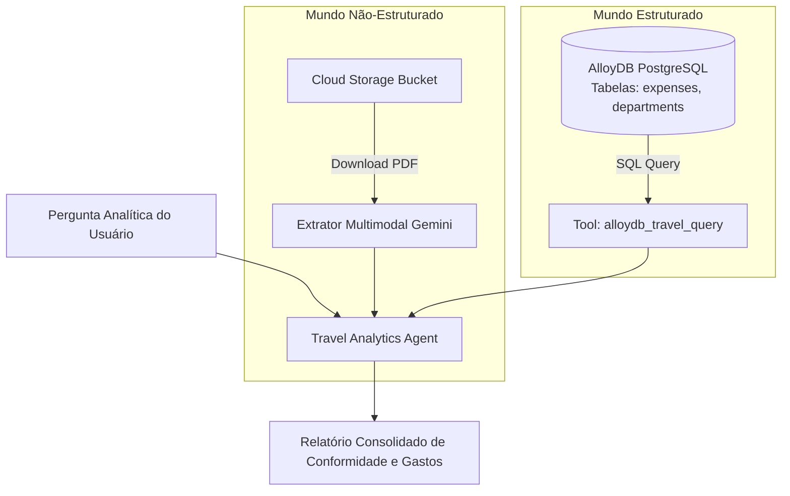

# 🗄️ Lab 3.5: Connect Agents to Unstructured and Structured Data Sources

* **Código do Laboratório / ID**: `65280141`
* **Curso Qwiklabs**: `[ELEVATE]: Advanced Agentic AI` (Course Template: `1738435`)
* **Módulo**: Módulo 3 - Policy Agents, Evaluation, and Challenge Lab
* **Paradigma de Execução**: `Guided Procedural`
* **Quantidade de Trackers de Atividade**: 2 Activity Trackers

---

## 📋 Sumário
1. [Visão Geral e Arquitetura Híbrida de Dados](#1-visão-geral-e-arquitetura-híbrida-de-dados)
2. [Conectores de Dados do Agente](#2-conectores-de-dados-do-agente)
3. [Passo a Passo de Implementação](#3-passo-a-passo-de-implementação)
   - [3.1 Fase 1: Ingestão de Dados Não-Estruturados (Cloud Storage)](#31-fase-1-ingestão-de-dados-não-estruturados-cloud-storage)
   - [3.2 Processamento de Recibos em PDF e Extração Multimodal](#32-processamento-de-recibos-em-pdf-e-extração-multimodal)
   - [3.3 Fase 2: Conexão a Dados Estruturados (AlloyDB / PostgreSQL)](#33-fase-2-conexão-a-dados-estruturados-alloydb--postgresql)
   - [3.4 Execução de Analytics SQL e Agregação de Despesas](#34-execução-de-analytics-sql-e-agregação-de-despesas)
4. [Tabela de Trackers de Atividade](#4-tabela-de-trackers-de-atividade)
5. [Boas Práticas de Integração de Dados](#5-boas-práticas-de-integração-de-dados)

---

## 1. Visão Geral e Arquitetura Híbrida de Dados

Em cenários corporativos reais, a informação raramente reside em um único formato. O **Lab 3.5** capacita o agente a interagir com dois mundos complementares:
1. **Dados Não-Estruturados**: Recibos de hotéis, passagens aéreas e comprovantes em PDF armazenados em buckets do **Cloud Storage (GCS)**.
2. **Dados Estruturados**: Histórico transacional de despesas, centros de custo e orçamentos em tabelas relacionais no **AlloyDB para PostgreSQL**.



---

## 2. Conectores de Dados do Agente

O agente expõe duas ferramentas registradas no ADK:
- `process_expense_receipts(bucket_name: str, prefix: str)`: Analisa arquivos binários e extrai entidades com o Gemini.
- `execute_travel_sql_analytics(query: str)`: Executa queries analíticas seguras no AlloyDB para consolidar somatórios por departamento.

---

## 3. Passo a Passo de Implementação

### 3.1 Fase 1: Ingestão de Dados Não-Estruturados (Cloud Storage)
Conexão do agente ao bucket de comprovantes:
```bash
# Inspecionar recibos no Cloud Storage
gsutil ls gs://${GOOGLE_CLOUD_PROJECT}-expense-receipts/
```

### 3.2 Processamento de Recibos em PDF
O agente invoca o modelo multimodal para ler comprovantes em imagem/PDF:
```python
from google.genai import types

def extract_receipt_data(pdf_bytes: bytes) -> dict:
    """Extrai valor, data, moeda e estabelecimento comercial de um PDF."""
    response = client.models.generate_content(
        model="gemini-3.6-flash",
        contents=[
            types.Part.from_bytes(data=pdf_bytes, mime_type="application/pdf"),
            "Extract merchant, total_amount, currency, and expense_date as JSON."
        ]
    )
    return json.loads(response.text)
```

### 3.3 Fase 2: Conexão a Dados Estruturados (AlloyDB)
Configuração do conector seguro com o AlloyDB Auth Proxy ou IP Privado:
```python
import asyncpg

async def query_travel_database(sql: str) -> list:
    """Executa consultas SELECT parametrizadas no banco de despesas."""
    conn = await asyncpg.connect(host=ALLOYDB_IP, database="expenses", user="travel_agent")
    rows = await conn.fetch(sql)
    await conn.close()
    return [dict(r) for r in rows]
```

### 3.4 Execução de Analytics SQL
Exemplo de agregação de gastos por categoria e comparação com os limites da política:
```sql
SELECT 
    department, 
    SUM(amount_usd) as total_spent, 
    COUNT(*) as claim_count 
FROM travel_claims 
GROUP BY department 
ORDER BY total_spent DESC;
```

---

## 4. Tabela de Trackers de Atividade

| Tracker ID | Descrição do Marco | Ação de Validação | Status |
| :---: | :--- | :--- | :---: |
| **AT 1** | *Connect to unstructured data and process expense documents* | Extração com sucesso dos dados dos comprovantes no GCS. | **PASSED** |
| **AT 2** | *Connect to structured data (AlloyDB) and execute SQL analytics* | Conexão ao AlloyDB e execução correta das queries SQL. | **PASSED** |

---

## 5. Boas Práticas de Integração de Dados

1. **Defesa contra Injeção de SQL**: O agente não deve aceitar SQL livre arbitrário; restrinja as queries a funções parametrizadas ou utilize uma camada de validação sintática (ex: somente comandos `SELECT`).
2. **Pipelines Multimodais Nativos**: O Gemini 3.6/3.8 Flash processa documentos PDF nativamente sem necessidade de pipelines pesados de OCR legados como Tesseract.
