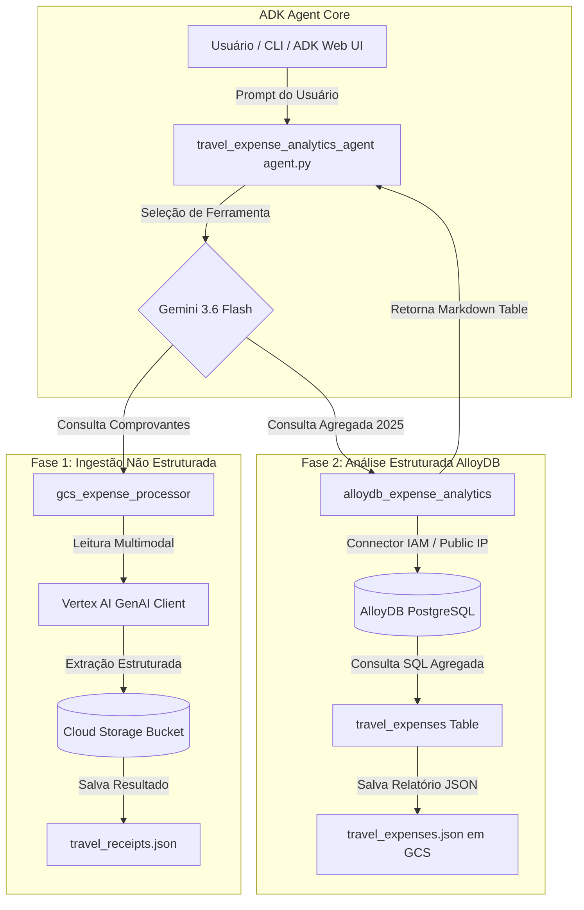

# 🎓 Guia de Estudos: Agente de Análise de Despesas de Viagem (`travel_expense_analytics_agent`)

[](https://www.python.org/)
[](https://cloud.google.com/)
[](https://adk.dev/)
[](https://deepmind.google/technologies/gemini/)
[](https://cloud.google.com/alloydb)

Este guia de estudos documenta a arquitetura, conceitos, ingestão multimodal não estruturada via **Google Cloud Storage (GCS)** e análise SQL relacional via **AlloyDB PostgreSQL** utilizando o agente **`travel_expense_analytics_agent`** construído com o **Google Agent Development Kit (ADK)** e o modelo **Gemini 3.6 Flash**.

---

## 📚 Sumário

1. [Módulo 1: Visão Geral e Arquitetura Unificada](#módulo-1-visão-geral-e-arquitetura-unificada)
2. [Módulo 2: Fase 1 - Ingestão Multimodal de Recibos no Cloud Storage (`gcs_expense_processor`)](#módulo-2-fase-1---ingestão-multimodal-de-recibos-no-cloud-storage-gcs_expense_processor)
3. [Módulo 3: Fase 2 - Análise Estruturada em AlloyDB PostgreSQL (`alloydb_expense_analytics`)](#módulo-3-fase-2---análise-estruturada-em-alloydb-postgresql-alloydb_expense_analytics)
4. [Módulo 4: Estrutura das Ferramentas e Definição do Agente (`tools.py` & `agent.py`)](#módulo-4-estrutura-das-ferramentas-e-definição-do-agente-toolspy--agentpy)
5. [Módulo 5: Configuração de Segurança e Conexão IAM (`.env`)](#módulo-5-configuração-de-segurança-e-conexão-iam-env)
6. [Módulo 6: Validação, Testes e Execução Hands-On (ADK CLI & Web UI)](#módulo-6-validação-testes-e-execução-hands-on-adk-cli--web-ui)
7. [Módulo 7: Resumo de Comandos e Referência Rápida](#módulo-7-resumo-de-comandos-e-referência-rápida)

---

## Módulo 1: Visão Geral e Arquitetura Unificada

A solução corporativa da **Cymbal Group** combina o processamento automatizado de documentos físicos e digitais não estruturados (recibos em imagem PNG e faturas PDF) com a análise SQL avançada de banco de dados relacional (AlloyDB PostgreSQL) em uma única interface inteligente baseada em agente ADK.



---

## Módulo 2: Fase 1 - Ingestão Multimodal de Recibos no Cloud Storage (`gcs_expense_processor`)

### Requisitos e Regras de Negócio
1. **Varredura Automatizada**: Iterar por todos os arquivos de recibos, faturas e comprovantes armazenados no bucket `gs://qwiklabs-gcp-00-ae747d64a28b-cepf/cymbal_group_expenses/`.
2. **Classificação Estrita**: Categorizar cada documento exclusivamente em uma das três categorias válidas:
   - `taxi invoice` (Fatura de Táxi)
   - `hotel bill` (Conta de Hotel)
   - `flight booking` (Reserva de Voo)
3. **Extração de Dados**:
   - `transaction_date`: Data da transação formatada como `YYYY-MM-DD`.
   - `amount_usd`: Valor total em dólares como número flutuante (`float`).
   - `description`: Breve resumo do gasto extraído do documento.
4. **Persistência**: Gravar o arquivo final formatado como `travel_receipts.json` no bucket do Cloud Storage.

---

## Módulo 3: Fase 2 - Análise Estruturada em AlloyDB PostgreSQL (`alloydb_expense_analytics`)

### Requisitos e Regras de Negócio
1. **Inicialização Resiliente**: Garantir que a tabela `travel_expenses` existe e possui dados. Se a tabela não estiver populada, o script realiza o download de `gs://qwiklabs-gcp-00-ae747d64a28b-cepf/travel_expenses_alloydb_export.sql` e insere os 350 registros automaticamente.
2. **Conexão Segura via Conector IAM**:
   - `google-cloud-alloydb-connector` com `enable_iam_auth=True`.
   - Conexão direta com IP Público (`ip_type=IPTypes.PUBLIC`).
   - Obtenção de credenciais de acesso via Secret Manager (`alloydb-password`).
3. **Consulta de Agregação de Despesas de 2025**:
   - Mapear a coluna `team` para o alias `team_name`.
   - Mapear a extração do mês `EXTRACT(MONTH FROM expense_date)` para o alias `month`.
   - Somar os valores da coluna `amount` com o alias `total_amount_usd`.
4. **Saída Dupla**:
   - Retornar tabela formatada em Markdown para o usuário na interface.
   - Salvar o arquivo `travel_expenses.json` no Cloud Storage.

---

## Módulo 4: Estrutura das Ferramentas e Definição do Agente (`tools.py` & `agent.py`)

### Definição do Agente (`travel_expense_analytics_agent/agent.py`):
```python
from google.adk.agents.llm_agent import Agent
from .tools import alloydb_expense_analytics, gcs_expense_processor

root_agent = Agent(
    model="gemini-3.6-flash",
    name="travel_expense_analytics_agent",
    description="Agente analítico de despesas de viagens corporativas.",
    instruction=(
        "Você é um assistente especialista em análise de despesas de viagens corporativas.\n"
        "Suas ferramentas disponíveis são:\n"
        "1. `gcs_expense_processor`: Processa recibos não estruturados no Cloud Storage.\n"
        "2. `alloydb_expense_analytics`: Conecta ao AlloyDB PostgreSQL para consultar despesas estruturadas "
        "agrupadas por equipe e mês em 2025.\n"
        "Apresente sempre os resultados formatados em tabelas Markdown limpas e organizadas."
    ),
    tools=[gcs_expense_processor, alloydb_expense_analytics]
)
```

---

## Módulo 5: Configuração de Segurança e Conexão IAM (`.env`)

As credenciais do cluster e as configurações do projeto são carregadas via arquivo [.env](file:///config/Desktop/cymbal-travel-policy-assistant/travel_expense_analytics_agent/.env):

```env
GOOGLE_GENAI_USE_VERTEXAI=TRUE
GOOGLE_CLOUD_PROJECT=qwiklabs-gcp-00-ae747d64a28b
GOOGLE_CLOUD_LOCATION=global

ALLOYDB_INSTANCE=projects/qwiklabs-gcp-00-ae747d64a28b/locations/us-central1/clusters/cepf-elevate-expenses/instances/cepf-elevate-expenses-primary
ALLOYDB_USER=student-04-1bcca417bfd3@qwiklabs.net
ALLOYDB_DATABASE=postgres
ALLOYDB_HOST=34.134.134.186
ALLOYDB_PORT=5432
ALLOYDB_PASSWORD=Password01
GOOGLE_API_USE_MTLS=never
```

---

## Módulo 6: Validação, Testes e Execução Hands-On (ADK CLI & Web UI)

### 1. Ingestão de Recibos Não Estruturados (Fase 1)
```bash
adk run travel_expense_analytics_agent "Process all raw travel receipts currently stored in the Cloud Storage bucket qwiklabs-gcp-00-ae747d64a28b-cepf, and save the processed output as travel_receipts.json within the same Cloud Storage bucket."
```

### 2. Consulta Analítica de Banco de Dados AlloyDB (Fase 2)
```bash
adk run travel_expense_analytics_agent "Show me a report of all travel expenses grouped by team and month for 2025 from AlloyDB and store output in travel_expenses.json file in the same Cloud Storage bucket."
```

### 3. Interface Web Interativa (ADK Web UI)
```bash
adk web
# Acessível via navegador em http://127.0.0.1:8000
```

---

## Módulo 7: Resumo de Comandos e Referência Rápida

| Ação | Comando |
| :--- | :--- |
| **Instalar Dependências** | `.venv/bin/pip install google-cloud-alloydb-connector[pg8000] pg8000 google-cloud-storage google-adk` |
| **Acessar Segredo da Senha** | `gcloud secrets versions access latest --secret="alloydb-password"` |
| **Verificar Status de Objeto GCS** | `gsutil stat gs://qwiklabs-gcp-00-ae747d64a28b-cepf/travel_expenses.json` |
| **Executar Agente ADK** | `echo "n" | adk run travel_expense_analytics_agent "<prompt>"` |
| **Iniciar Servidor Web ADK** | `echo "n" | adk web` |
